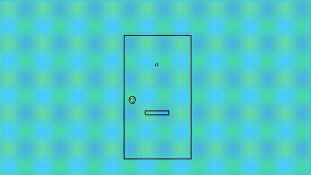

  

<h1 align="center">✨ Hi there, Beautiful People 👋 ✨</h1>
<h3 align="center">🌍 Frontend Developer | From Bangladesh</h3>

  

  💻 Passionate about <b>Web Development</b>, <b>Problem Solving</b>, and <b>Building Scalable Applications</b>  
  🚀 Always exploring new technologies & improving myself every day  
  ✨ Let’s create something amazing together!  

---

  

---

# 👋 About Me

- 👀 **Passionate about Software Engineering, Full Stack Development, and Deployment.**

- 🌱 **Currently expanding my expertise in modern Full Stack Development.**

- 💼 **Working as a Full Stack Software Developer.**

## 💻 Tech Stack

### Backend

### Frontend

### Styling

### Server Management

---

- 🤝 **Open to collaborating on exciting software development projects.**

- 📫 **Email:** **<a href="mailto:alnomaan30@gmail.com">alnomaan30@gmail.com</a>**

- 🌐 **Portfolio:** **<a href="https://alnoman.vercel.app" target="_blank">alnoman.vercel.app</a>**

---

  <!-- GitHub Streak -->
  <picture>
    <source
      media="(prefers-color-scheme: dark)"
      srcset="https://streak-stats.demolab.com?user=alnoman30&theme=github-dark-blue&hide_border=true"
    />
    <source
      media="(prefers-color-scheme: light)"
      srcset="https://streak-stats.demolab.com?user=alnoman30&theme=default&hide_border=true"
    />
    
  </picture>

  <!-- Top Languages -->
  <picture>
    <source
      media="(prefers-color-scheme: dark)"
      srcset="https://github-readme-stats-sigma-five.vercel.app/api/top-langs/?username=alnoman30&layout=compact&theme=github_dark&hide_border=true&langs_count=8"
    />
    <source
      media="(prefers-color-scheme: light)"
      srcset="https://github-readme-stats-sigma-five.vercel.app/api/top-langs/?username=alnoman30&layout=compact&theme=default&hide_border=true&langs_count=8"
    />
    
  </picture>

---

  

<picture data-importer="pacman">
  <source
    media="(prefers-color-scheme: dark)"
    srcset="https://raw.githubusercontent.com/alnoman30/alnoman30/pacman-output/pacman-contribution-graph-dark.svg"
  />
  <source
    media="(prefers-color-scheme: light)"
    srcset="https://raw.githubusercontent.com/alnoman30/alnoman30/pacman-output/pacman-contribution-graph.svg"
  />
  
</picture>
